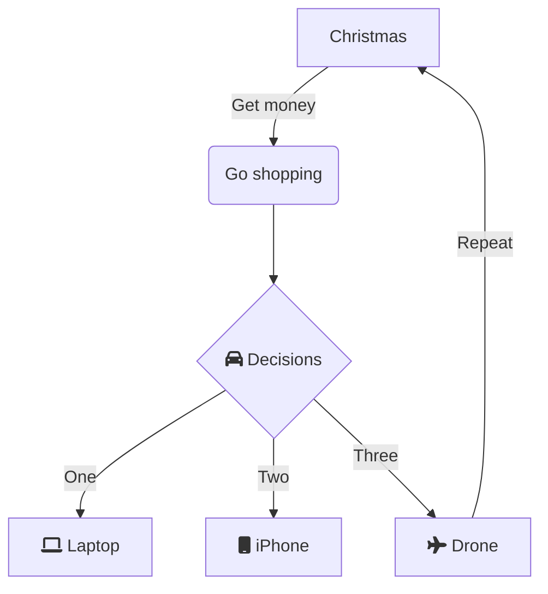
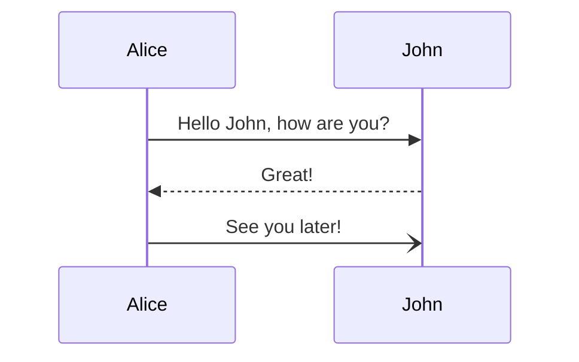

# Learn Mermaid

Learn how to use **`Mermaid.js`**
to create data-driven diagrams.

Mermaid lets you create diagrams and visualizations using text and code.
~ https://mermaid-js.github.io

# Why?

# What?

GitHub _recently_ included Mermaid support
in their Makdown parser:
https://github.blog/2022-02-14-include-diagrams-markdown-files-mermaid

This means we can now include basic code/data-driven diagrams
as _living_ documentation in our projects!

# Who?

# Where?

Mermaid diagrams can be used

# When?

Now!

# How?

The easiest way to test out mermaid and learn
is using the Live Editor: https://mermaid.live


## Overview For Beginners

The best place for an intro is in the offical docs:
[Overview for beginners](https://github.com/mermaid-js/mermaid/blob/develop/docs/n00b-overview.md#overview-for-beginners)

## IDE Integration/Support

Sadly, at the time of writing,
VSCode/VSCodium does not have built-in support
for rendering Mermaid.js diagrams.
So when you _preview_ a `Markdown` (`.md`) file

## Examples

### Flow Diagram

```
graph TD
    A[Christmas] -->|Get money| B(Go shopping)
    B --> C{fa:fa-car Decisions}
    C -->|One| D[fa:fa-laptop Laptop]
    C -->|Two| E[fa:fa-mobile iPhone]
    C -->|Three| F[fa:fa-plane Drone]
    F -->|Repeat| A
```



### Sequence Diagram

```
sequenceDiagram
    Alice->>John: Hello John, how are you?
    John-->>Alice: Great!
    Alice-)John: See you later!
```



# Relevant Reading

- Awesome diagrams using Mermaid.js:
  https://dev.to/erfankashani/awesome-diagrams-using-mermaidjs-3am0
